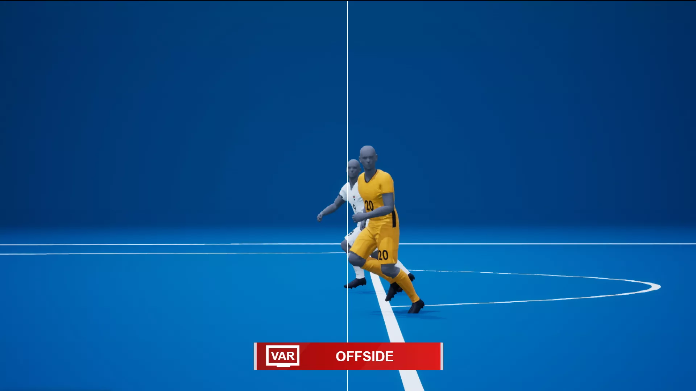

# computer-vision-project
Project of Computer Vision course, A.Y. 2022/2023, Sapienza University of Rome.

## Semi-automated offside detection for Football

## Abstract

Here, I present my attempt toward the creation of a mechanism by which the problem of incorrect offside decisions made by referees in football can be addressed. The purpose of this system is to replicate the operation of the semi-automatic offside introduced in the last edition of the <b>Fifa World Cup in Qatar</b> but with some assumptions and restrictions. The offside detection problem is simplified by classifying the attacking and defending team based on the half in which the foward ball is played. Further the assumption that team members wear the same coloured jerseys works towards simplifying the problem.
The implementation involves two separate modules that track the ball and players respectively. The successful integration of the modules leads to the desired goal of offside detection.
  

## Approach
* The problem was broken down into a **ball tracking module** and a  **player tracking module** then combining the two to detect Offside. 
* The **ball tracking module** would take care of detecting the ball, tracking it and detecting whether a ball pass has occurred. 
* The **player tracking module** would detect the players of each team, attacking and defending, and get an approximate location of the foot of the players. 
* Finally the two would be integrated into one program. The ball pass is detected only when it is passed from one player to different player. 
* If the player of the attacking team receiving the pass (when he receives the pass) is behind the last player of the defending team then offside is called.
* The offside region is shown by a line passing through the position of the last defender.
* Note that offside is NOT called if the attacking player is behind the offside line but doesn’t receive the ball.

## Ball Tracking:
* I tried multiple techniques for ball detection namely colour thresholding, histogram backprojection, Hough circle transform and dlib library's correlation tracker
* Out of these, colour thresholding seemed to work the best. Its simple and efficient (Occam's Razor :P). Although it will give noise if colour of ball matches the background and thus we used it along with background subtraction.
* Histogram backprojection is another good technique and using a 2D histogram of hue and value gives us some robustness in terms of lighting condition.
* Hough circle transform gave too musch noise.
* Dlib library’s correlation tracker is great but it failed at tracking small and fast moving object like football. It also slows down immensely if number of objects to be tracked exceeds 3.
#### Detection and Tracking of Ball on the basis of colour using Thresholding
* Get a sample patch of the ball as input
* Convert from the default RGB space to the HSV colour space and get the range of Hue, Saturation and Value
* Apply background subtraction to get a mask
* Apply the mask to the frame

## Usage of the system:
* To detect offside in a pre-recorded video, go to the folder in which code and video are stored and type the following in terminal:
```javascript
$ python offside.py -v 'path/name of video file'
```
* To detect offside from live camera feed:
```javascript
$ python offside.py
```
* While running the program, press ***'i'*** to input and ***'q'*** to quit
